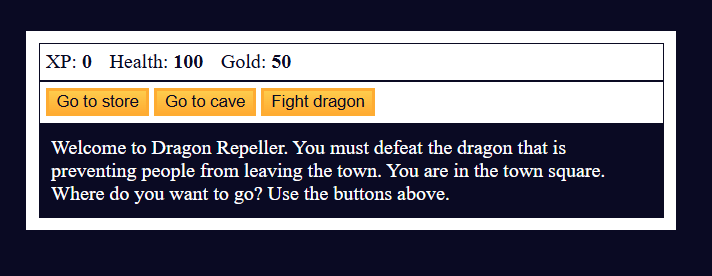

# Adventure Game

## Description
This is a simple text-based adventure game where the player navigates different locations, fights monsters, earns gold, and upgrades weapons. The objective is to defeat the dragon and win the game.

## Features
- Navigate between different locations: town square, store, cave, and fight scenes.
- Buy health and weapons at the store.
- Fight various monsters: slime, fanged beast, and dragon.
- Gain experience points (XP) and gold.
- Play an easter egg mini-game.
- Win by defeating the dragon.

## Gameplay Instructions
1. Start in the town square with options to visit the store, cave, or fight the dragon.
2. Buy health or weapons at the store if you have enough gold.
3. Enter the cave to fight monsters and earn rewards.
4. Fight the dragon for the final challenge.
5. Win by defeating the dragon or lose if your health reaches zero.
6. Restart the game if you lose or win.

## Controls
- Three main buttons to navigate and take actions.
- Click buttons to move to different locations or engage in battles.

## Technologies Used
- HTML
- CSS
- JavaScript

## How to Run
1. Download or clone the repository.
2. Open `index.html` in a web browser.
3. Play the game by clicking the available buttons.

## Future Improvements
- Add more monsters and locations.
- Implement a save game feature.
- Improve UI and animations.

Enjoy the adventure!

